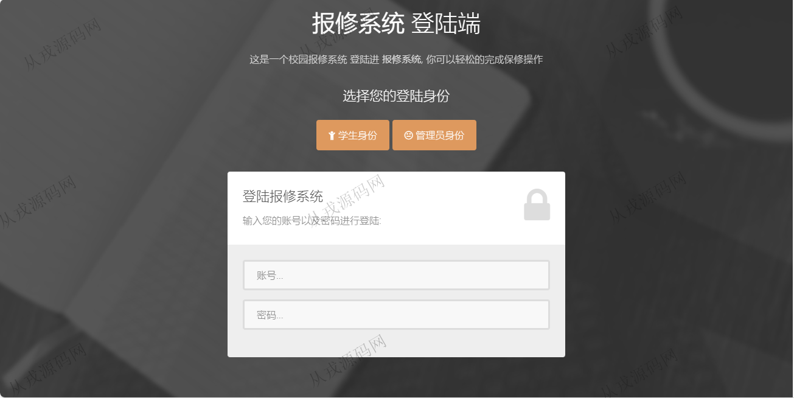
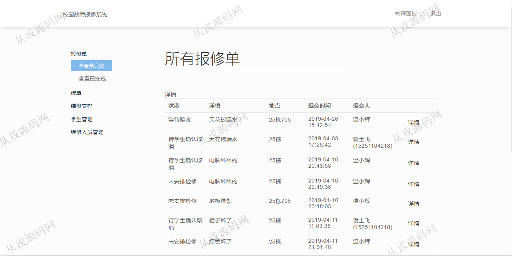
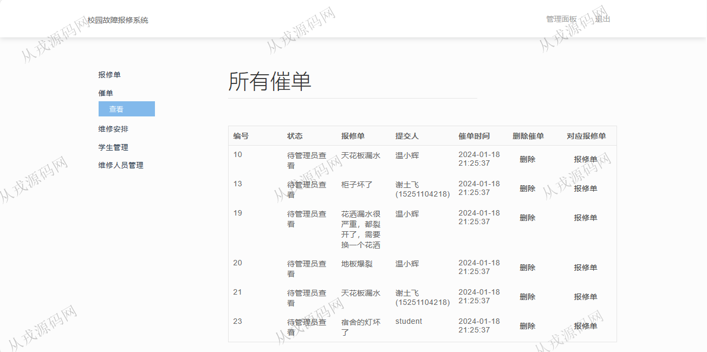
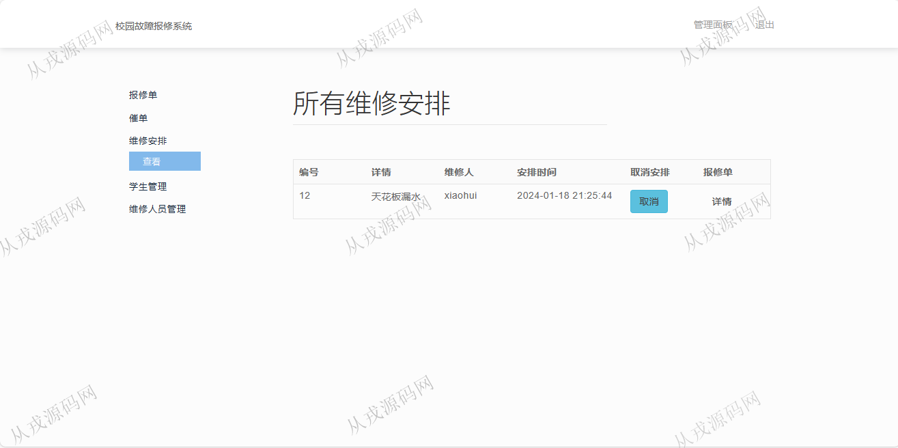
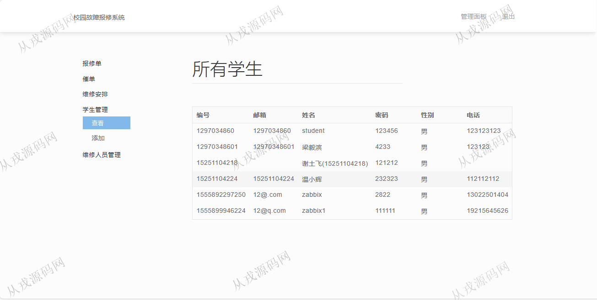
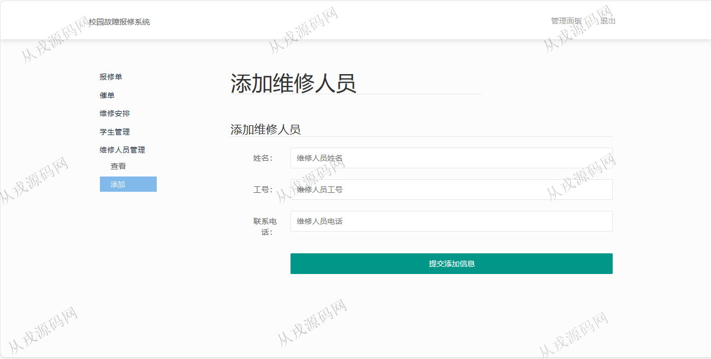
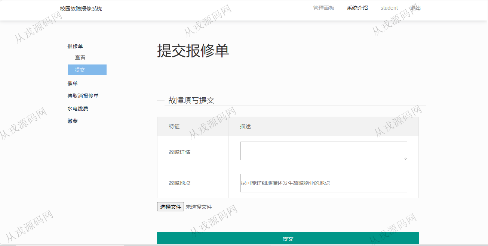
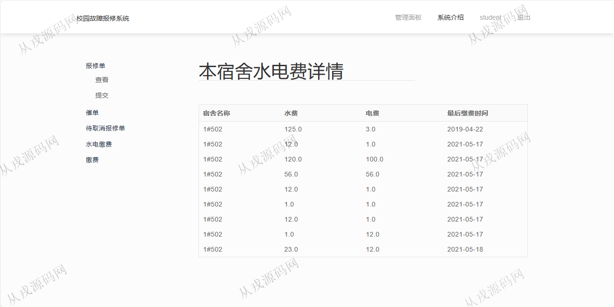
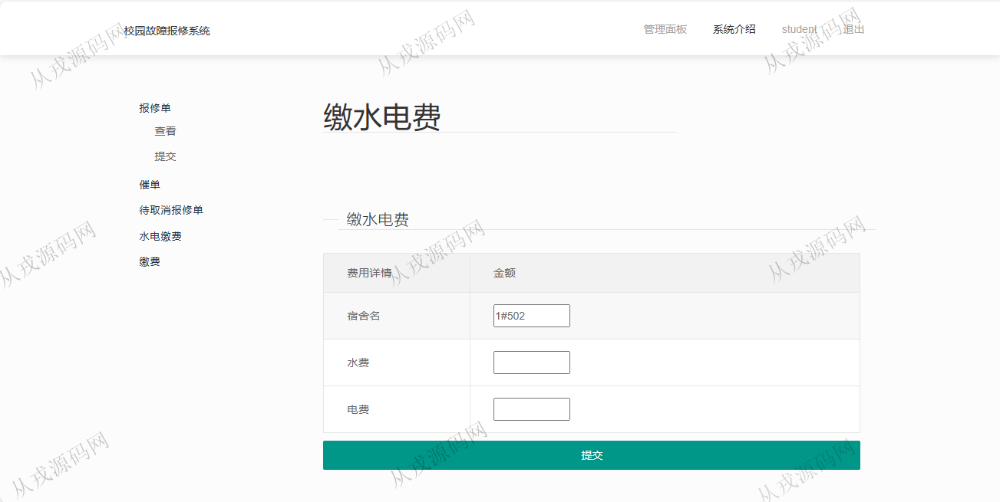

<h1 align="center">174.校园故障报修管理系统</h1>

 获取sql文件 QQ: 386869957 QQ群: 377586148 

 [更多源码项目: 从戎源码网](https://armycodes.com/) 

## 简介

> 本代码来源于网络,仅供学习参考使用!
>
> 提供1.远程部署/2.修改代码/3.设计文档指导/4.框架代码讲解等服务
> 
> 访问地址：http://localhost:18084/student/login
> 
> 管理员：11232 123456
> 
> 学生：1297034860 123456
> 

## 项目介绍
基于springboot的校园故障报修管理系统【含报告】：前端 jsp、jquery，后端 maven、springmvc、spring、mybatis；角色分为管理员、用户；集成报修单，水电缴费，催单等功能于一体的系统。

## 功能介绍

### 学生

- 报修单：报修单列表查询，详情查看，修改，删除，催单，故障填写提交，附件上传
- 催单：催单列表查询，删除催单，重新催单
- 待取消报修单：所有待取消的报修单的列表查询
- 水电缴费：水电费缴费清单查询，缴水电费

### 管理员

- 报修单：报修单列表查询，详情查看，查看未完成，查看已完成
- 催单：催单列表查询，删除催单信息，查看对应报修单
- 维修安排：给报修单安排维修，取消安排
- 学生管理：学生信息的列表查询，学生添加
- 维修人员管理：维修人员的列表查询，维修人员添加

## 环境

- <b>IntelliJ IDEA 20021.3</b>

- <b>Mysql 5.7.26</b>

- <b>JDK 1.8</b>

## 运行截图

